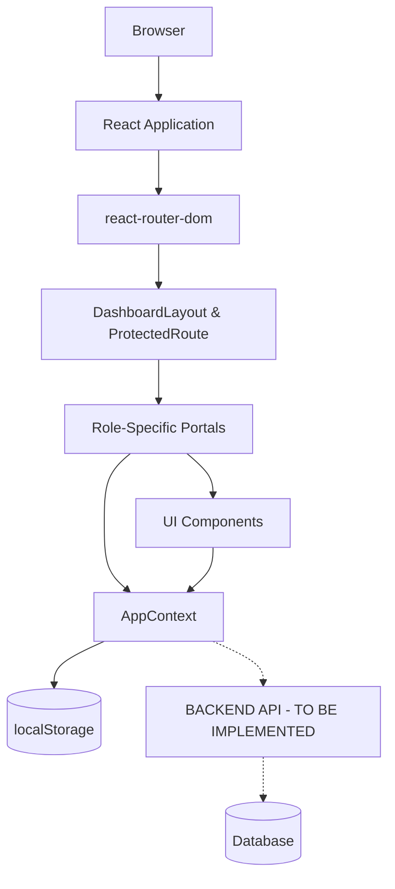
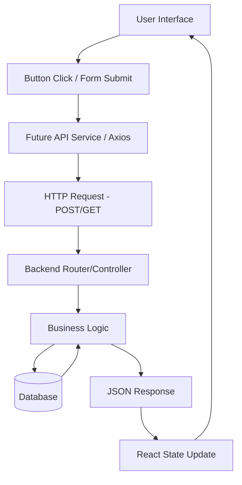

# FRONTEND_BACKEND_HANDOFF_REPORT
# Micro-Logistics Management System
## Forensic Analysis and Backend Handoff Documentation

==================================================
## 1. PROJECT INFORMATION
==================================================

- **Project name**: Micro-Logistics Management System
- **Frontend**: Currently completed (React, Vite)
- **Backend**: Not implemented yet
- **Database**: Not implemented yet
- **Frontend deployment**: Vercel
- **Production URL**: https://micro-logistics.vercel.app
- **Vercel project**: micro-logistics

==================================================
## 2. COMPLETE CODEBASE INSPECTION
==================================================

The project is built as a single-page application (SPA) using React 19 and Vite. The codebase is entirely structured in JavaScript/JSX without strict TypeScript typing, though some components utilize modern React paradigms.

### Core Structure:
- `package.json` & `package-lock.json`: Manage dependencies.
- `vite.config.js`: Vite configuration for the bundler.
- `public/`: Static assets.
- `src/`: Main source code directory containing:
  - `App.jsx`: Main routing file.
  - `main.jsx`: Application entry point.
  - `auth/`: Authentication related pages (Login, Registration).
  - `components/`: Reusable UI elements (admin, common, customer, delivery, seller).
  - `context/`: State management (`AppContext.jsx`).
  - `data/`: Mock data (`sampleData.js`).
  - `layouts/`: Application layouts (`DashboardLayout.jsx`).
  - `portals/`: Page-level components separated by role (admin, customer, delivery, seller).
  - `styles/`: Global CSS.
  - `utils/`: Utility functions (`aggregationUtils.js`).

**Note on `.git` and `node_modules`**: Both exist in the root environment. No `.env` files were found, meaning all configuration is currently hardcoded or reliant on defaults.

==================================================
## 3. GENERATE A COMPLETE FILE INVENTORY
==================================================

*This section inventories the critical files for backend integration.*

### Core Files
1. **`src/App.jsx`**
   - *Type*: React Router config
   - *Purpose*: Defines all application routes and role-based protection.
   - *Exports*: `App` component.
   - *Imports*: All portal pages, `ProtectedRoute`, `DashboardLayout`, `AppContext`.
   - *Backend Relevance*: Defines the route structure the backend must support for deep-linking.

2. **`src/context/AppContext.jsx`**
   - *Type*: React Context Provider
   - *Purpose*: Mocks all backend data and state management.
   - *Main Functions*: `addToCart`, `placeOrder`, `registerCustomer`, `registerSeller`, `createDeliveryBatch`, `assignAgentToBatch`.
   - *Backend Relevance*: **CRITICAL**. This file simulates the entire backend. The backend must replace every function here with an API call.

3. **`src/data/sampleData.js`**
   - *Type*: Mock Data Configuration
   - *Purpose*: Provides initial state for `AppContext`.
   - *Backend Relevance*: Dictates the initial JSON schema the frontend expects from the database.

### Portals / Pages (Role-based)

**Auth Portal (`src/auth/`)**
- `LoginPage.jsx`: Handles user login. [Requires POST `/api/auth/login`]
- `CustomerRegisterPage.jsx`: Customer signup. [Requires POST `/api/auth/register/customer`]
- `SellerRegisterPage.jsx`: Seller signup. [Requires POST `/api/auth/register/seller`]
- `LandingPage.jsx`: Public landing page.

**Admin Portal (`src/portals/admin/`)**
- `AdminDashboard.jsx`: Dashboard overview. [Requires GET `/api/admin/stats`]
- `AdminCentralOrdersPage.jsx`: View all orders. [Requires GET `/api/admin/orders`]
- `OrderAggregationPage.jsx`: Batching orders. [Requires POST `/api/admin/batches`]
- `DeliveryManagementPage.jsx`: Assigning agents. [Requires POST `/api/admin/batches/{id}/assign`]
- `MapPlanning.jsx`: Visual route planning.
- *Others*: Analytics, Customers, Sellers, Settings, Reports, Notifications, DeliveryAgents.

**Customer Portal (`src/portals/customer/`)**
- `CustomerDashboard.jsx`: Customer home.
- `BrowseSellersPage.jsx`: List of vendors. [Requires GET `/api/vendors`]
- `CartPage.jsx`, `CheckoutPage.jsx`: Order creation flow. [Requires POST `/api/orders`]
- `OrdersPage.jsx`, `TrackDeliveryPage.jsx`: Order history and tracking.
- *Others*: Profile, Settings, Notifications.

**Seller Portal (`src/portals/seller/`)**
- `DashboardOverview.jsx`: Seller home.
- `ProductsPage.jsx`: Manage inventory. [Requires GET/POST/PUT/DELETE `/api/products`]
- `DeliveriesPage.jsx`: Track seller's deliveries.
- *Others*: Analytics, BusinessProfile.

**Delivery Portal (`src/portals/delivery/`)**
- `DeliveryDashboard.jsx`: Agent home.
- `MyDeliveriesPage.jsx`, `RoutePage.jsx`: View assigned batches/routes. [Requires GET `/api/deliveries/assigned`]
- `DeliveryStatusPage.jsx`: Update delivery status. [Requires PUT `/api/orders/{id}/status`]

### Components (`src/components/common/`)
- `ProtectedRoute.jsx`: Checks user role from Context to allow/deny access.
- `Sidebar.jsx`, `Header.jsx`: UI layout components.
- `MapPlaceholder.jsx`: Simulates mapping since no external API key (like Google Maps) is provided.

==================================================
## 4. APPLICATION ARCHITECTURE
==================================================

**Architecture Overview:**
- **Framework**: React 19
- **Language**: JavaScript (JSX)
- **Build tool**: Vite
- **Styling system**: Vanilla CSS (Global & Component-scoped CSS files). Tailwind is NOT used.
- **UI Architecture**: Component-based with a global `DashboardLayout` for authenticated routes.
- **State Management**: React Context (`AppContext.jsx`) wrapping the entire application, backed by `localStorage` for persistence.
- **Routing**: Client-side routing via `react-router-dom`.
- **API Communication**: **NONE CURRENTLY IMPLEMENTED**. No `fetch` or `axios` exists.
- **Authentication**: Mocked client-side via Context state (`currentUser`).

**Mermaid Diagram:**


==================================================
## 5. COMPLETE ROUTING DOCUMENTATION
==================================================

| Route | Page | Auth Required | Roles Allowed | Actions / Purpose |
|------|------|---------------|---------------|-------------------|
| `/` | `LandingPage` | No | All | Public marketing page |
| `/login` | `LoginPage` | No | All | User authentication |
| `/register-customer` | `CustomerRegisterPage` | No | All | Customer signup |
| `/register-seller` | `SellerRegisterPage` | No | All | Vendor signup |
| `/customer-dashboard` | `CustomerDashboard` | Yes | `customer` | Customer overview |
| `/browse-sellers` | `BrowseSellersPage` | Yes | `customer` | View vendors/products |
| `/cart` | `CartPage` | Yes | `customer` | Manage cart |
| `/checkout` | `CheckoutPage` | Yes | `customer` | Place order |
| `/vendor-dashboard` | `DashboardOverview` | Yes | `vendor` | Seller overview |
| `/products` | `ProductsPage` | Yes | `vendor`, `admin` | Manage catalog |
| `/admin-dashboard` | `AdminDashboard` | Yes | `admin` | System overview |
| `/admin/order-aggregation` | `OrderAggregationPage` | Yes | `admin` | Create delivery batches |
| `/admin/delivery-management` | `DeliveryManagementPage` | Yes | `admin` | Assign batches to agents |
| `/delivery-dashboard` | `DeliveryDashboard` | Yes | `delivery_partner` | Agent overview |
| `/delivery/deliveries` | `MyDeliveriesPage` | Yes | `delivery_partner` | View assigned routes |

==================================================
## 6. EVERY USER EXECUTION PATH
==================================================

### Feature: Order Creation Flow
1. User (Customer) navigates to `/browse-sellers`.
2. User selects a product and clicks "Add to Cart" -> Triggers `addToCart()` in `AppContext`.
3. User navigates to `/checkout`.
4. User fills out delivery address and time slot.
5. User clicks "Place Order" -> Triggers `placeOrder()` in `AppContext`.
6. `placeOrder()` splits the cart by vendor and creates separate order objects with status `PLACED`.
7. **[Backend Required]**: POST `/api/orders` with cart payload.
8. User is redirected to `/orders`.

### Feature: Delivery Batch Creation (Admin)
1. Admin navigates to `/admin/order-aggregation`.
2. Admin selects multiple orders that are `READY_FOR_DELIVERY`.
3. Admin clicks "Create Batch" -> Triggers `createDeliveryBatch(orderIds)` in `AppContext`.
4. System groups orders into a Batch object with status `Pending Assignment`.
5. **[Backend Required]**: POST `/api/delivery-batches` with array of order IDs.

### Feature: Agent Assignment (Admin)
1. Admin navigates to `/admin/delivery-management`.
2. Admin views pending batches and available agents.
3. Admin assigns Agent X to Batch Y -> Triggers `assignAgentToBatch(batchId, agentId)`.
4. Batch status becomes `Assigned`. Agent status becomes `On Delivery`.
5. **[Backend Required]**: POST `/api/delivery-batches/{batchId}/assign` with `agentId`.

### Feature: Delivery Fulfillment (Agent)
1. Delivery Partner navigates to `/delivery/status`.
2. Partner marks order as picked up -> Triggers `confirmOrderPickup(orderId)`.
3. Partner marks order as delivered -> Triggers `confirmOrderDelivery(orderId)`.
4. **[Backend Required]**: PUT `/api/orders/{id}/status` with new status enum.

==================================================
## 7. COMPONENT-BY-COMPONENT ANALYSIS
==================================================

- **`ProtectedRoute.jsx`**: Wraps routes. Checks `currentUser.role` against `allowedRoles` prop. Redirects to `/login` if unauthorized.
- **`DashboardLayout.jsx`**: Renders `Sidebar` and `Header` alongside the `children` (page content).
- **`Sidebar.jsx`**: Dynamically renders navigation links based on `currentUser.role`.
- **`Header.jsx`**: Displays user avatar, notifications dropdown (mocked), and logout button.

==================================================
## 8. HOOKS ANALYSIS
==================================================

- **`useAppContext()`**: Custom hook. The central lifeline of the application. Exposes all mocked data (orders, users, batches) and mutation functions.
- **`useState` / `useEffect`**: Heavily used inside `AppContext.jsx` to synchronize state with `localStorage` (e.g., `useEffect(() => { localStorage.setItem(...) }, [orders])`).

==================================================
## 9. STATE MANAGEMENT
==================================================

**Global State Architecture:**
- All global state lives in `AppContext.jsx`.
- Initialized from `localStorage` (e.g., `micrologi_orders`), falling back to `sampleData.js` if empty.

**Key State Variables:**
- `currentUser`: The authenticated user object. Determines role-based routing.
- `orders`: Array of all orders in the system.
- `vendors`: Array of all seller profiles.
- `customers`: Array of all customer profiles.
- `deliveryAgents`: Array of delivery personnel.
- `deliveryBatches`: Array of aggregated order routes.
- `products`: Catalog of all items.
- `cart`: Customer's current shopping cart.

==================================================
## 10. API / BACKEND REQUIREMENTS
==================================================

**[CONFIRMED] No APIs exist in the frontend code. Zero `fetch` or `axios` calls.**
The following are **IMPLIED APIs** that the backend *must* implement to replace `AppContext` functionality.

### BACKEND ENDPOINTS THAT MUST BE IMPLEMENTED

| Feature | Method | Endpoint | Expected Payload | Auth |
|---------|--------|----------|-------------------|------|
| Auth | POST | `/api/auth/login` | `{ email, password }` | None |
| Auth | POST | `/api/auth/register/customer`| `{ fullName, email, password... }` | None |
| Auth | POST | `/api/auth/register/vendor` | `{ businessName, email... }` | None |
| Products| GET | `/api/products` | `?vendorId=123` | JWT |
| Products| POST | `/api/products` | `{ name, price, stock, vendorId }` | Vendor |
| Orders | POST | `/api/orders` | `{ items: [], deliveryLocation, slot }` | Customer|
| Orders | GET | `/api/orders` | `?customerId=123` or `?vendorId=123`| JWT |
| Orders | PUT | `/api/orders/:id/status` | `{ status: "PREPARING" }` | Vendor/Admin |
| Batches | POST | `/api/batches` | `{ orderIds: [...] }` | Admin |
| Batches | POST | `/api/batches/:id/assign` | `{ agentId: "da123" }` | Admin |
| Agents | GET | `/api/delivery-agents` | - | Admin |
| Users | PUT | `/api/users/profile` | `{ address, phone, etc }` | JWT |

==================================================
## 11. BACKEND DATA MODELS
==================================================

Based on `sampleData.js` and `AppContext.jsx`, the backend must support these entities:

### 1. User / Customer
- `id` (String/UUID)
- `name` (String)
- `email` (String, Unique)
- `role` (Enum: `customer`, `vendor`, `admin`, `delivery_partner`)
- `address`, `phone`, `lat`, `lng`

### 2. Vendor (Extends User)
- `businessName` (String)
- `category` (String)
- `operatingHours` (String)
- `status` (Enum: `Active`, `Inactive`)

### 3. Product
- `id` (String)
- `vendorId` (FK -> Vendor)
- `name`, `price`, `stock`, `status`

### 4. Order
- `id` (String)
- `customerId` (FK -> Customer)
- `vendorId` (FK -> Vendor)
- `batchId` (FK -> Batch, Nullable)
- `items` (JSON / Array of OrderItems)
- `total` (Float)
- `status` / `orderStatus` / `deliveryStatus` (Enums - *Backend must standardize these, frontend currently uses multiple overlapping status strings*)

### 5. DeliveryBatch
- `id` (String)
- `agentId` (FK -> DeliveryAgent)
- `orderIds` (Array of FKs -> Orders)
- `status` (String)

==================================================
## 12. FORM ANALYSIS
==================================================

- **Customer Register (`CustomerRegisterPage.jsx`)**: Fields: `fullName`, `username`, `email`, `phone`, `address`, `cityArea`, `password`.
- **Seller Register (`SellerRegisterPage.jsx`)**: Fields: `businessName`, `ownerName`, `username`, `email`, `phone`, `businessAddress`, `cityArea`, `category`, `password`.
- **Checkout (`CheckoutPage.jsx`)**: Fields: `deliveryAddress`, `contactPhone`, `deliveryDate`, `deliveryTimeSlot`.

*Action*: Backend must validate these payloads as the frontend only does basic HTML5 validation.

==================================================
## 13. VALIDATION RULES
==================================================

[INFERRED]
- Emails must be valid format.
- Passwords must be hashed by backend (currently stored in plain text in mock).
- Orders cannot be placed with an empty cart.
- Order quantities must be > 0.
- Delivery slot must be a valid enum or timestamp.

==================================================
## 14. AUTHENTICATION AND AUTHORIZATION
==================================================

[CONFIRMED] **Frontend authentication is currently mocked.**
- `currentUser` state in Context dictates access.
- Role-based UI is enforced via `ProtectedRoute.jsx`.

**Backend Requirement**: 
Implement JWT or Session-based Auth. The login endpoint must return a token and the user's `role`. The frontend will need to be refactored to store this token (e.g., in `localStorage` or `HttpOnly` cookies) and pass it in the `Authorization: Bearer <token>` header via an Axios interceptor.

==================================================
## 15. MOCK DATA / PLACEHOLDERS
==================================================

# MOCK → REAL BACKEND MIGRATION MAP
- **`AppContext.jsx`**: Every state variable (`orders`, `vendors`, etc.) must be replaced by `useEffect` fetch calls to the backend on component mount.
- **`addNotification()`**: Currently pushes to an array. Needs a backend Notifications table and polling/WebSockets for real-time updates.
- **Maps**: `MapPlaceholder.jsx` uses static CSS. Will need integration with Google Maps API or Mapbox, passing actual `lat`/`lng` from the backend.

==================================================
## 16. DATABASE REQUIREMENTS
==================================================

### Confirmed frontend data requirements
- Relational structure heavily implied (Orders belong to Customers and Vendors; Orders belong to Batches; Batches belong to Agents).
- PostgreSQL or MySQL is highly recommended given the relational nature of logistics, orders, and users.

[BACKEND DECISION REQUIRED]
- How to handle historical order data?
- Standardize the `status` enums. Frontend uses overlapping states (`orderStatus`, `deliveryStatus`, `aggregationStatus`). Backend should normalize this to a single state machine.

==================================================
## 17. ERROR AND LOADING FLOWS
==================================================

[INFERRED]
Currently, because state is synchronous (React Context), there are very few loading spinners or error boundaries.
When APIs are introduced, the frontend will need to be updated to handle `isLoading` and `error` states for network requests. Backend must return standard HTTP status codes (400, 401, 403, 404, 500) with clear error messages.

==================================================
## 18. SEARCH, FILTERING, SORTING AND PAGINATION
==================================================

Currently, filtering (e.g., viewing orders for a specific vendor) is done client-side using `Array.prototype.filter()`.
**Backend Requirement**: Implement server-side pagination and filtering for `/api/orders` and `/api/products` to ensure scalability.

==================================================
## 19. FILE UPLOADS / DOWNLOADS
==================================================

- Avatars and Logos are currently hardcoded Unsplash image URLs.
**Backend Requirement**: Implement an AWS S3 (or similar) upload endpoint for `avatar` and `logo` fields during registration and profile updates.

==================================================
## 20. NOTIFICATIONS
==================================================

- System currently uses client-side toasts/arrays (`addNotification`).
**Backend Requirement**: Requires a `Notification` entity to persist notifications across sessions, and potentially WebSockets for real-time dispatch alerts to delivery agents.

==================================================
## 21. EXTERNAL DEPENDENCIES
==================================================

| Package | Version | Purpose | Backend Relevance |
|---------|---------|---------|-------------------|
| `react` | 19.2.8 | Core Framework | None |
| `react-router-dom` | 7.18.3 | Routing | Deep linking support |
| `lucide-react` | 1.41.0 | Icons | None |
| `vite` | 8.2.2 | Bundler | None |

*(Note: Axios is NOT installed. The frontend team will need to add it during backend integration).*

==================================================
## 22. ENVIRONMENT VARIABLES
==================================================

[CONFIRMED] No environment variables are currently in use.
**Backend Requirement**: Frontend will need a `.env` file containing `VITE_API_BASE_URL` pointing to the new backend infrastructure.

==================================================
## 23. DEPLOYMENT PROCESS COMPLETED
==================================================

- Frontend is deployed to Vercel at `https://micro-logistics.vercel.app`.
- **Backend is NOT deployed.**
- **Database is NOT deployed.**
- Backend developer must configure CORS on the backend to accept requests from `https://micro-logistics.vercel.app` and `http://localhost:5173`.

==================================================
## 24. BUILD AND RUN PROCESS
==================================================

- Install: `npm install`
- Run Development: `npm run dev`
- Build Production: `npm run build`
- Preview Build: `npm run preview`

==================================================
## 25. EXECUTION PATH DIAGRAMS
==================================================

**Frontend to Future Backend Data Flow:**


==================================================
## 26. COMPLETE FEATURE MATRIX
==================================================

| Feature | UI Exists | Logic Exists | API Exists | Mocked | Status |
|---------|-----------|--------------|------------|--------|--------|
| Authentication | Yes | Partial | No | Yes | BACKEND REQUIRED |
| Role Routing | Yes | Yes | N/A | N/A | COMPLETE FRONTEND |
| Cart/Checkout | Yes | Yes | No | Yes | BACKEND REQUIRED |
| Order Batching | Yes | Yes | No | Yes | BACKEND REQUIRED |
| Agent Assign | Yes | Yes | No | Yes | BACKEND REQUIRED |
| Delivery Tracking| Yes | No | No | Yes | BACKEND REQUIRED |

==================================================
## 27. FRONTEND COMPLETION STATUS
==================================================

### Completed
- UI Layouts, CSS, Responsive Design.
- Client-side routing and role-based route protection.
- Forms and UI components.

### Mocked / Backend Dependent
- **EVERYTHING ELSE**. 100% of data fetching, authentication, and state mutation is mocked in `AppContext.jsx`.

==================================================
## 28. BACKEND IMPLEMENTATION CHECKLIST
==================================================

### MUST IMPLEMENT
- [ ] Database schema (Users, Products, Orders, Batches).
- [ ] Authentication system (JWT) and `/api/auth` endpoints.
- [ ] CRUD endpoints for Products and Orders.
- [ ] Order Batching logic (`/api/batches`).
- [ ] Agent assignment logic.
- [ ] CORS configuration for Vercel domain.

### REQUIRES DESIGN DECISION
- Standardizing the Order Status state machine.
- Real-time tracking: Will it be WebSocket based or polling?
- Map integration: Who provides the API keys?

==================================================
## 29. FRONTEND ↔ BACKEND CONTRACT
==================================================

*Example Contract for Order Creation:*
- **Frontend Component**: `CheckoutPage.jsx`
- **Method**: POST
- **Endpoint**: `/api/orders`
- **Request Payload**: 
  ```json
  {
    "items": [{"productId": "p1", "qty": 2}],
    "deliveryAddress": "123 Street",
    "deliverySlot": "Morning"
  }
  ```
- **Backend Expected**: Create Order, calculate totals, assign to vendor.
- **Response**: `201 Created` with Order Object.
- **State Update**: Add to `orders` array, clear `cart`.

==================================================
## 30. KNOWN ISSUES / RISKS
==================================================

- **State Standardization**: `AppContext.jsx` uses `orderStatus`, `deliveryStatus`, and `aggregationStatus` simultaneously. This is fragile. The backend should emit a single `status` enum, and the frontend should derive UI text from it.
- **Lack of Network Error Handling**: Because data is mocked synchronously, the frontend UI lacks `<LoadingSpinner />` and `try/catch` UI error boundaries. The frontend team must add these when hooking up the APIs.
- **Missing API Client**: Axios is not installed. Needs to be configured with interceptors to attach Auth tokens.

==================================================
## 31. QUESTIONS FOR BACKEND DEVELOPER
==================================================

# BACKEND DESIGN QUESTIONS
1. **Authentication**: Will we use JWT in `localStorage` or `HttpOnly` cookies?
2. **Database**: PostgreSQL or MongoDB? (Relational strongly recommended based on UI).
3. **Status Machine**: Can we consolidate the 3 different status strings into one strict Enum?
4. **Real-time**: Does the Delivery Agent tracking require WebSockets (Socket.io) or is 30-second polling acceptable?
5. **Pagination**: The UI currently shows all data on a single page. What is the pagination strategy for `/api/orders`?

*End of Document*
