# Micro-Logistics Management System: Architectural & Operational Handbook (Mermaid Edition)

> **Document Version**: 2.0.0  
> **Target Audience**: Full-Stack Engineers, DevOps, System Architects, QA Engineers, and Product Managers  
> **Scope**: System Topology, Multi-Tenant Routing, Tri-State Order Lifecycle, Aggregation Engine, Database ERD, and Sequence Workflows.

---

## Table of Contents
1. [Chapter 1: System Purpose & Core Concept](#chapter-1-system-purpose--core-concept)
2. [Chapter 2: Full-Stack System Architecture](#chapter-2-full-stack-system-architecture)
3. [Chapter 3: Database Entity-Relationship Architecture (ERD)](#chapter-3-database-entity-relationship-architecture-erd)
4. [Chapter 4: Multi-Tenant Role & Route Navigation Hierarchy](#chapter-4-multi-tenant-role--route-navigation-hierarchy)
5. [Chapter 5: Order, Batch & Delivery Tri-State Lifecycle](#chapter-5-order-batch--delivery-tri-state-lifecycle)
6. [Chapter 6: Smart Order Aggregation Algorithm Engine](#chapter-6-smart-order-aggregation-algorithm-engine)
7. [Chapter 7: End-to-End Operational Sequence Diagrams](#chapter-7-end-to-end-operational-sequence-diagrams)
8. [Chapter 8: Data Mapping & Legacy ID Compatibility Layer](#chapter-8-data-mapping--legacy-id-compatibility-layer)
9. [Chapter 9: System Edge Cases & Exception Handling Workflows](#chapter-9-system-edge-cases--exception-handling-workflows)

---

## Chapter 1: System Purpose & Core Concept

### 1.1 The Micro-Logistics Paradigm
Traditional on-demand delivery models operate on an un-batched **1:1 Courier Dispatch** model, generating high delivery fees and route redundancies. **Micro-Logistics** shifts to a **Multi-Vendor Milk-Run Aggregation** model:

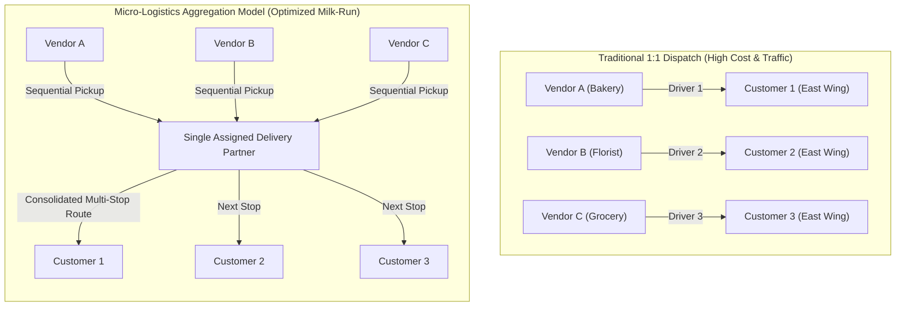

### 1.2 Core Business Objectives
* **Batch Density**: Combine 2 to 4 customer drops within a 3–8 km spatial radius into a single driver trip.
* **Scheduled Time-Slot Windows**: Orders are matched against overlapping fixed delivery time-slots (7–11 AM, 9 AM–1 PM, 12–4 PM, 3–7 PM, 6–10 PM).
* **Multi-Merchant Staging**: Enable consumers to order from diverse neighborhood merchants with a single scheduled arrival.
* **Tamper-Proof Handover**: OTP authentication between driver and recipient.

---

## Chapter 2: Full-Stack System Architecture

### 2.1 Complete Architectural Topology
The application follows a decoupled client-server architecture:

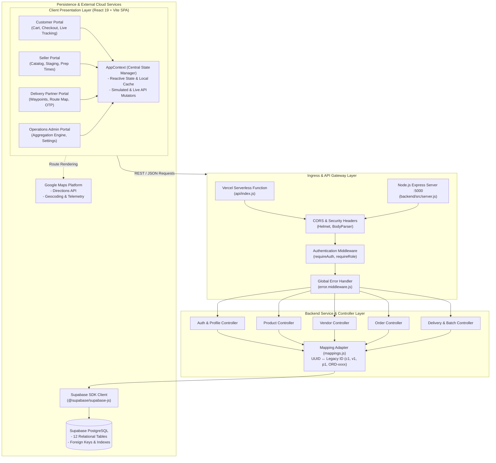

---

## Chapter 3: Database Entity-Relationship Architecture (ERD)

### 3.1 Entity-Relationship Diagram

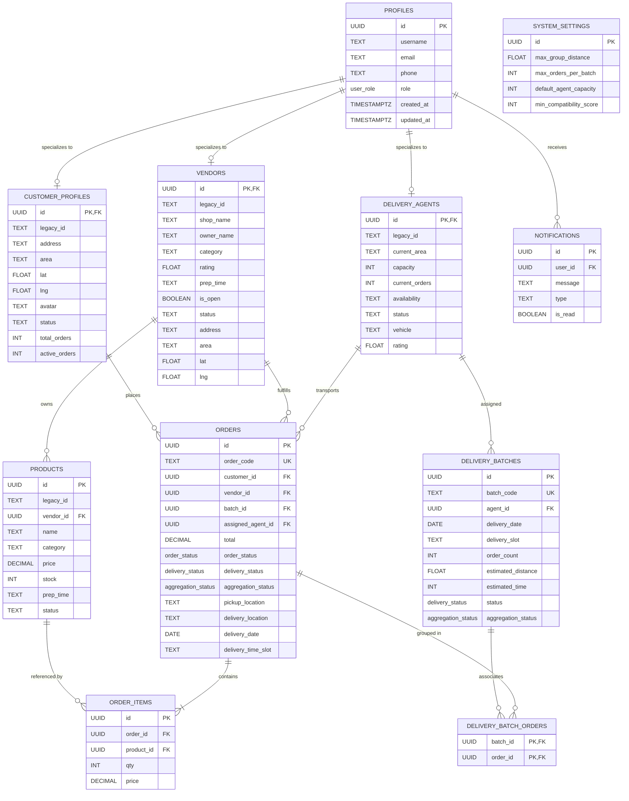

---

## Chapter 4: Multi-Tenant Role & Route Navigation Hierarchy

### 4.1 Route Guarding & Component Tree

```mermaid
graph TD
    Entry(["App.jsx Router"]) --> PR{"ProtectedRoute Guard"}

    PR -->|role: customer| C_Layout["Customer Layout & Nav"]
    PR -->|role: vendor| V_Layout["Vendor Layout & Nav"]
    PR -->|role: delivery_partner| D_Layout["Delivery Layout & Nav"]
    PR -->|role: admin| A_Layout["Admin Layout & Nav"]
    PR -->|unauthenticated| Auth_Routes["Public Auth Routes"]

    subgraph CustTree ["Customer Portal Views"]
        C_Layout --> C_Dash["CustomerDashboard.jsx (/customer/dashboard)"]
        C_Layout --> C_Browse["BrowseSellersPage.jsx (/customer/browse)"]
        C_Layout --> C_Cart["CartPage.jsx (/customer/cart)"]
        C_Layout --> C_Check["CheckoutPage.jsx (/customer/checkout)"]
        C_Layout --> C_Track["TrackDeliveryPage.jsx (/customer/track/:id)"]
        C_Layout --> C_Sched["DeliverySchedulePage.jsx (/customer/schedule)"]
        C_Layout --> C_Ord["OrdersPage.jsx (/customer/orders)"]
        C_Layout --> C_Prof["ProfilePage.jsx (/customer/profile)"]
    end

    subgraph VendTree ["Seller Portal Views"]
        V_Layout --> V_Dash["DashboardOverview.jsx (/seller/dashboard)"]
        V_Layout --> V_Prod["ProductsPage.jsx (/seller/products)"]
        V_Layout --> V_Ord["OrdersPage.jsx (/seller/orders)"]
        V_Layout --> V_Inv["InventoryPage.jsx (/seller/inventory)"]
    end

    subgraph DelivTree ["Delivery Partner Portal Views"]
        D_Layout --> D_Dash["DeliveryDashboard.jsx (/delivery/dashboard)"]
        D_Layout --> D_Batches["DeliveriesPage.jsx (/delivery/deliveries)"]
        D_Layout --> D_Route["RoutePage.jsx & ActiveDeliveryPage.jsx (/delivery/route)"]
        D_Layout --> D_Hist["DeliveryHistoryPage.jsx (/delivery/history)"]
    end

    subgraph AdminTree ["Admin Operations Portal Views"]
        A_Layout --> A_Dash["AdminDashboard.jsx (/admin/dashboard)"]
        A_Layout --> A_Agg["OrderAggregationPage.jsx (/admin/order-aggregation)"]
        A_Layout --> A_Track["DeliveryTrackingPage.jsx (/admin/tracking)"]
        A_Layout --> A_Vend["SellersManagementPage.jsx (/admin/sellers)"]
        A_Layout --> A_Cust["CustomersManagementPage.jsx (/admin/customers)"]
        A_Layout --> A_Sett["AdminSettingsPage.jsx (/admin/settings)"]
    end

    subgraph AuthTree ["Authentication Views"]
        Auth_Routes --> L_Cust["LoginPage.jsx (/login)"]
        Auth_Routes --> R_Cust["CustomerRegisterPage.jsx (/register)"]
        Auth_Routes --> R_Vend["VendorRegisterPage.jsx (/seller/register)"]
    end
```

---

## Chapter 5: Order, Batch & Delivery Tri-State Lifecycle

### 5.1 The Tri-State Lifecycle Engine
Every order exists simultaneously across three distinct domain axes:

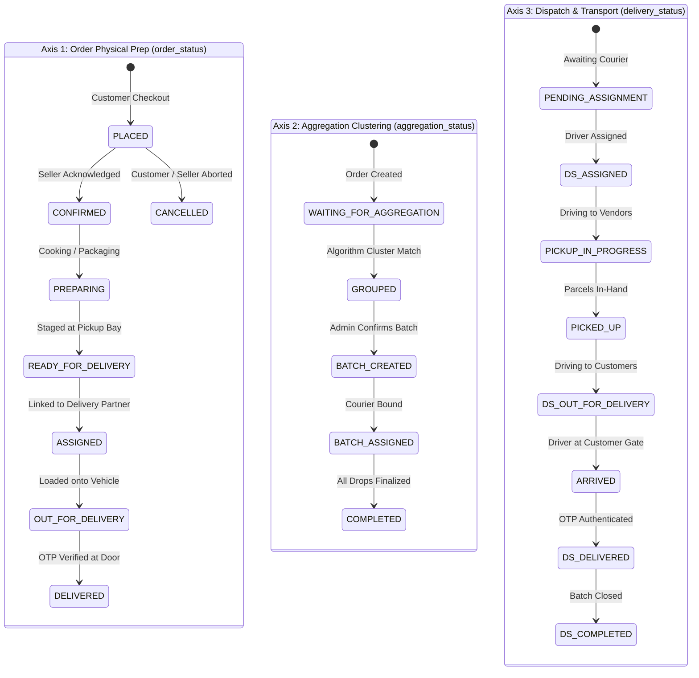

### 5.2 Tri-State Synchronization Matrix

| Milestone | `order_status` | `aggregation_status` | `delivery_status` | Trigger Event / Actor |
| :--- | :--- | :--- | :--- | :--- |
| **Order Placement** | `PLACED` | `WAITING_FOR_AGGREGATION` | `PENDING_ASSIGNMENT` | Customer clicks "Confirm Order" |
| **Merchant Acceptance**| `PREPARING` | `WAITING_FOR_AGGREGATION` | `PENDING_ASSIGNMENT` | Seller updates order in portal |
| **Staged for Pickup** | `READY_FOR_DELIVERY` | `WAITING_FOR_AGGREGATION` | `PENDING_ASSIGNMENT` | Seller packages items |
| **Clustering Match** | `READY_FOR_DELIVERY` | `GROUPED` | `PENDING_ASSIGNMENT` | Aggregation engine generates candidate |
| **Batch Approved** | `READY_FOR_DELIVERY` | `BATCH_CREATED` | `PENDING_ASSIGNMENT` | Admin clicks "Create Batch" |
| **Courier Bound** | `ASSIGNED` | `ASSIGNED` | `ASSIGNED` | Admin allocates batch to agent |
| **Vendor Pickup Run** | `ASSIGNED` | `ASSIGNED` | `PICKUP_IN_PROGRESS` | Driver starts pickup phase |
| **Parcels Collected** | `ASSIGNED` | `ASSIGNED` | `PICKED_UP` | Driver confirms collection at stores |
| **Transit to Customer**| `OUT_FOR_DELIVERY` | `ASSIGNED` | `OUT_FOR_DELIVERY` | Driver begins milk-run drops |
| **Doorstep Handover** | `DELIVERED` | `COMPLETED` | `DELIVERED` | Driver submits customer 4-digit OTP |

---

## Chapter 6: Smart Order Aggregation Algorithm Engine

### 6.1 Algorithm Decision Flowchart (`findSuitableOrderGroups`)

```mermaid
flowchart TD
    Start([Initiate Aggregation Cycle]) --> Fetch[Query Orders with aggregation_status = WAITING_FOR_AGGREGATION]
    Fetch --> DateGroup[Partition Orders by Target deliveryDate]
    
    DateGroup --> OuterLoop[Select Primary Unassigned Order (Seed)]
    OuterLoop --> InnerLoop[Evaluate Candidate Order Against Seed]
    
    InnerLoop --> CheckTime{areTimeSlotsCompatible?<br/>Exact slot or overlapping window?}
    CheckTime -- No --> RejectCandidate[Skip Candidate]
    CheckTime -- Yes --> CheckGeo{Are Pickup/Delivery Areas Nearby?<br/>extractArea within radius?}
    
    CheckGeo -- No --> RejectCandidate
    CheckGeo -- Yes --> AddCandidate[Add to Group Candidate Buffer]
    
    AddCandidate --> CapacityCheck{Group Size == maxOrdersPerBatch (4)?}
    CapacityCheck -- No --> MoreCandidates{More candidate orders in date?}
    MoreCandidates -- Yes --> InnerLoop
    MoreCandidates -- No --> ComputeScore
    CapacityCheck -- Yes --> ComputeScore[Calculate Group Compatibility Score]

    subgraph ScoringWeights ["Weighted Scoring Calculation (Min: 60, Max: 98)"]
        ComputeScore --> S_Base["Base Score: 50"]
        S_Base --> S_Date["+15: Same Delivery Date"]
        S_Date --> S_Time["+20: Exact Slot Match / +12: Overlapping Slot"]
        S_Time --> S_Pickup["+10: Same Merchant Hub / +5: Nearby"]
        S_Pickup --> S_Drop["+10: Same Neighborhood / +5: Nearby"]
        S_Drop --> S_Ready["+10: All Orders READY_FOR_DELIVERY"]
        S_Ready --> S_Agent["+5: Available Driver Capacity"]
    end

    S_Agent --> FormBatchObj[Generate Candidate Object with Metrics:<br/>- batchId: SUG-Bxxx<br/>- estimatedDistance: 2.5 + count * 1.2 km<br/>- estimatedTime: 15 + distance * 6 mins]
    FormBatchObj --> RenderAdmin[Render Suggested Batch Cards in OrderAggregationPage.jsx]
```

---

## Chapter 7: End-to-End Operational Sequence Diagrams

### 7.1 Multi-Vendor Checkout & Order Scheduling

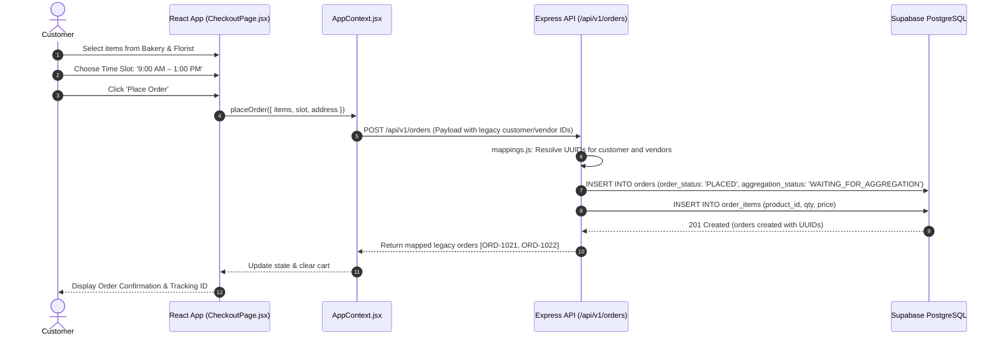

### 7.2 Aggregation Engine & Driver Batch Assignment

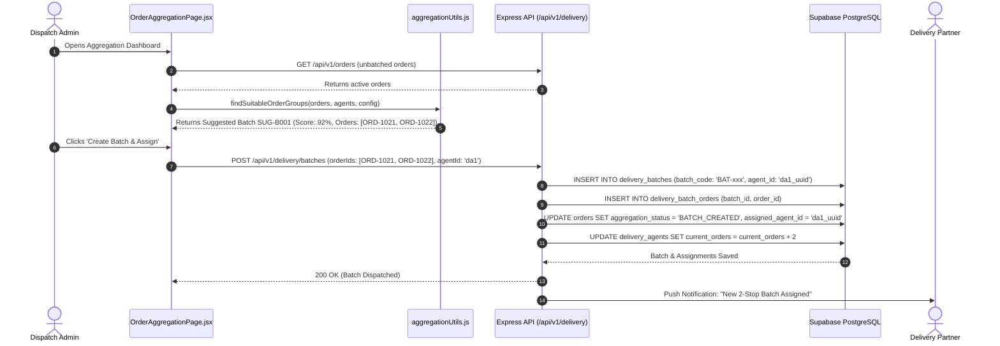

### 7.3 Milk-Run Delivery Execution & OTP Handover

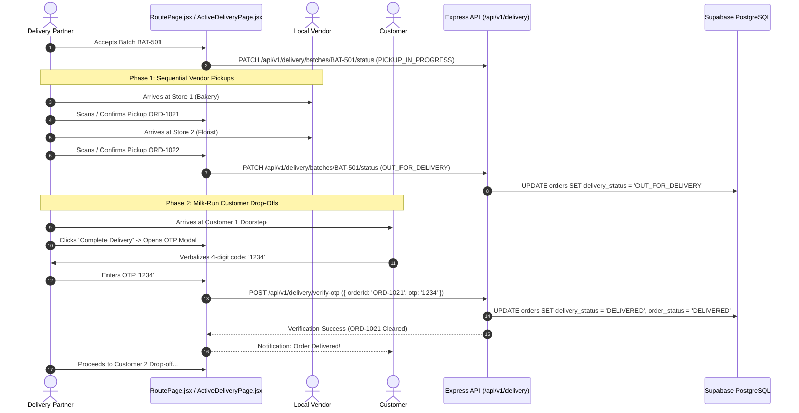

---

## Chapter 8: Data Mapping & Legacy ID Compatibility Layer

### 8.1 The Compatibility Translation Flow (`mappings.js`)
To maintain zero regressions with the React frontend's legacy identifier formats while using strict PostgreSQL UUIDs, the backend incorporates a translation layer:

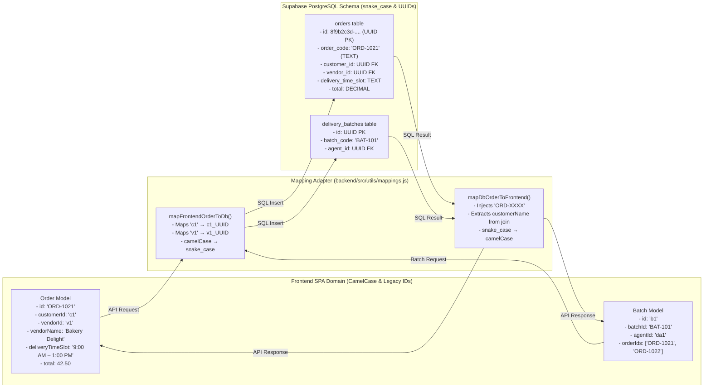

---

## Chapter 9: System Edge Cases & Exception Handling Workflows

### 9.1 Exception 1: Customer Order Cancellation During Staging

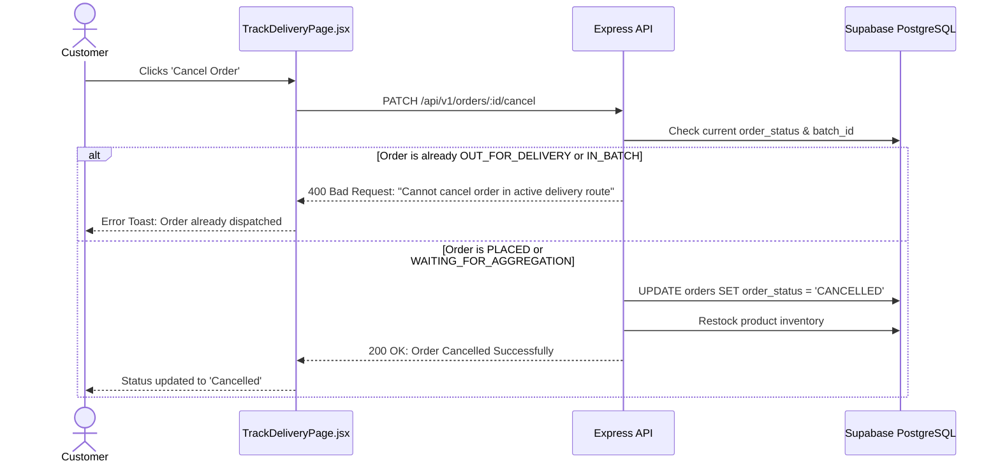

### 9.2 Exception 2: OTP Verification Failure at Handover

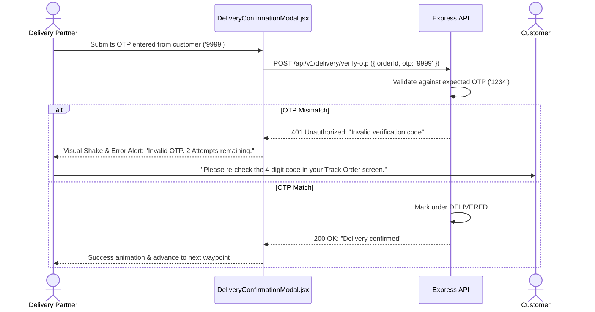

### 9.3 Exception 3: Delivery Partner Offline / Capacity Exhaustion

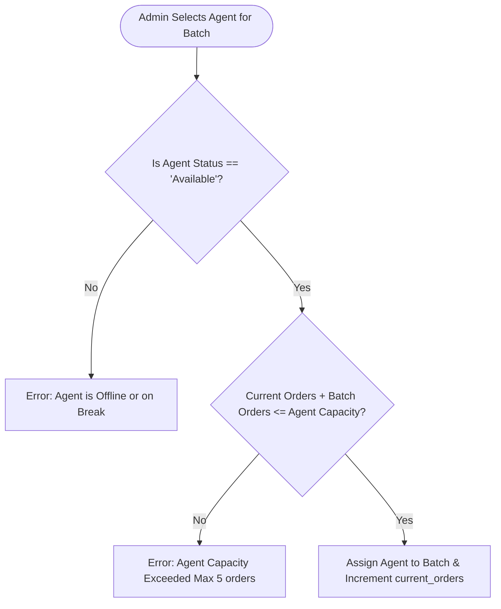

---

## Summary Reference Table

| Chapter | Primary Mermaid Type | Primary File References |
| :--- | :--- | :--- |
| **Ch 1: Concept & Paradigm** | `flowchart TB` | [`README.md`](file:///c:/Users/N.AJAYKUMAR/ABI'S%20PROJECT/Micro-Logistics/README.md), [`aggregationUtils.js`](file:///c:/Users/N.AJAYKUMAR/ABI'S%20PROJECT/Micro-Logistics/src/utils/aggregationUtils.js) |
| **Ch 2: System Architecture** | `graph TB` | [`App.jsx`](file:///c:/Users/N.AJAYKUMAR/ABI'S%20PROJECT/Micro-Logistics/src/App.jsx), [`backend/src/app.js`](file:///c:/Users/N.AJAYKUMAR/ABI'S%20PROJECT/Micro-Logistics/backend/src/app.js), [`api/index.js`](file:///c:/Users/N.AJAYKUMAR/ABI'S%20PROJECT/Micro-Logistics/api/index.js) |
| **Ch 3: Database ERD** | `erDiagram` | [`0001_initial_schema.sql`](file:///c:/Users/N.AJAYKUMAR/ABI'S%20PROJECT/Micro-Logistics/backend/supabase/migrations/0001_initial_schema.sql) |
| **Ch 4: Role & Route Tree** | `graph TD` | [`App.jsx:42`](file:///c:/Users/N.AJAYKUMAR/ABI'S%20PROJECT/Micro-Logistics/src/App.jsx#L42), [`portals/`](file:///c:/Users/N.AJAYKUMAR/ABI'S%20PROJECT/Micro-Logistics/src/portals) |
| **Ch 5: Tri-State Lifecycle** | `stateDiagram-v2` | [`aggregationUtils.js:12-37`](file:///c:/Users/N.AJAYKUMAR/ABI'S%20PROJECT/Micro-Logistics/src/utils/aggregationUtils.js#L12-L37) |
| **Ch 6: Aggregation Engine** | `flowchart TD` | [`aggregationUtils.js:75-214`](file:///c:/Users/N.AJAYKUMAR/ABI'S%20PROJECT/Micro-Logistics/src/utils/aggregationUtils.js#L75-L214) |
| **Ch 7: Operational Sequences** | `sequenceDiagram` | [`CheckoutPage.jsx`](file:///c:/Users/N.AJAYKUMAR/ABI'S%20PROJECT/Micro-Logistics/src/portals/customer/CheckoutPage.jsx), [`OrderAggregationPage.jsx`](file:///c:/Users/N.AJAYKUMAR/ABI'S%20PROJECT/Micro-Logistics/src/portals/admin/OrderAggregationPage.jsx) |
| **Ch 8: Data Mapping Layer** | `flowchart LR` | [`mappings.js`](file:///c:/Users/N.AJAYKUMAR/ABI'S%20PROJECT/Micro-Logistics/backend/src/utils/mappings.js) |
| **Ch 9: Exception Workflows** | `sequenceDiagram`, `flowchart TD` | [`DeliveryConfirmationModal.jsx`](file:///c:/Users/N.AJAYKUMAR/ABI'S%20PROJECT/Micro-Logistics/src/portals/delivery/DeliveryConfirmationModal.jsx) |
