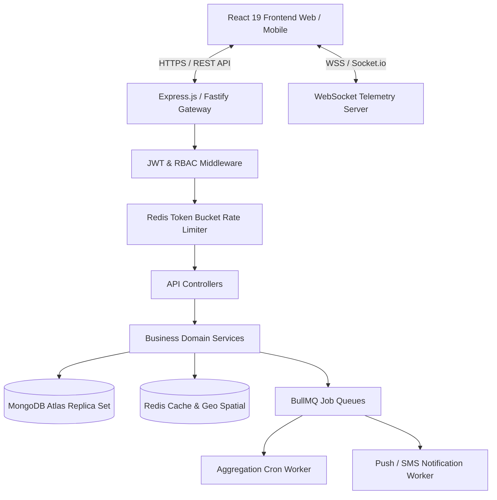
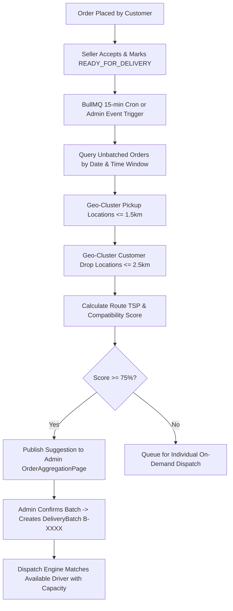

# Enterprise Backend Architecture Proposal & Engineering Blueprint

**Project Name:** Smart Micro-Logistics Management Network  
**Document Type:** Technical Architecture Proposal & Implementation Specification  
**Version:** 1.0.0 (Production Release Target)  
**Author:** Senior Backend Architect & Distributed Systems Engineer  
**Date:** September 13, 2026  
**Frontend Alignment:** Fully mapped to React 19 Client (`AppContext`, Multi-Portal RBAC, Real-Time Aggregation Engine)

---

## 1. Executive Summary & Purpose

The **Smart Micro-Logistics Platform** frontend provides a 4-portal multi-tenant interface (Customer, Local Seller/Vendor, Central Admin/Dispatcher, and Delivery Partner). The current frontend utilizes an in-memory client state simulator (`AppContext.jsx`).

To transition this platform into a production-grade, highly available commercial application, a dedicated server architecture is required to guarantee:
1. **Data Authority & Persistence:** Safe storage and multi-role access control for orders, vendors, catalogs, and dispatch records.
2. **Concurrency & Inventory Locking:** Preventing overselling of perishable local store stock during peak checkout windows.
3. **Automated Order Aggregation Engine:** Running autonomous clustering algorithms that bundle orders from nearby shops to nearby customers in matching delivery time slots.
4. **Real-Time Telemetry & Tracking:** Low-latency GPS coordinate streaming from delivery partner devices to customer tracking screens.
5. **Secure Verification Pipeline:** Cryptographic 4-digit OTP proof-of-delivery workflow.

---

## 2. Technology Stack & Rationale



| Component | Technology Selected | Engineering Rationale |
| :--- | :--- | :--- |
| **Runtime & Language** | **Node.js (v20+ LTS) + TypeScript** | Strict type safety, high concurrency, asynchronous non-blocking I/O ideal for logistics dispatch. |
| **Web Framework** | **Express.js** (or Fastify) | Industry standard, mature ecosystem for RBAC middleware, robust security plugins (`helmet`, `cors`). |
| **Primary Database** | **MongoDB (with Mongoose ODM)** | Native support for GeoJSON spherical indexing (`2dsphere`), dynamic catalog attributes, and schema evolution. |
| **Cache & Message Broker** | **Redis (v7.2+)** | In-memory distributed lock for checkout concurrency, `GEOADD`/`GEORADIUS` for driver GPS tracking, and BullMQ worker backend. |
| **Real-Time Communication** | **Socket.io** | Bidirectional event-driven connection with automatic fallback, room-based isolation (`order:<id>`, `batch:<id>`). |
| **Validation Layer** | **Zod** | Runtime request body validation with compile-time TypeScript type inference. |
| **Task Queue / Workers** | **BullMQ** | Guaranteed execution of periodic order grouping crons and async SMS/Email notifications. |

---

## 3. Database Architecture & Collections (MongoDB)

All schemas are engineered to directly satisfy the existing React 19 frontend contracts.

### 3.1 `users` Collection
Manages authentication, roles, and profile information.
```typescript
{
  _id: ObjectId,
  name: String,                   // "Priya Rajan"
  username: { type: String, unique: true, index: true },
  email: { type: String, unique: true, index: true },
  passwordHash: String,           // bcrypt hash (min salt rounds 12)
  phone: String,                  // "9876543210"
  role: { 
    type: String, 
    enum: ['customer', 'vendor', 'admin', 'delivery_partner'],
    required: true,
    index: true 
  },
  address: String,
  area: String,                   // "T. Nagar, Chennai"
  location: {
    type: { type: String, default: 'Point' },
    coordinates: [Number]         // [longitude, latitude]
  },
  avatarUrl: String,
  isActive: { type: Boolean, default: true },
  createdAt: Date,
  updatedAt: Date
}
```

### 3.2 `vendors` Collection (Seller Store Profiles)
Maps to `src/portals/seller/BusinessProfilePage.jsx` and `src/portals/customer/BrowseSellersPage.jsx`.
```typescript
{
  _id: ObjectId,
  userId: { type: ObjectId, ref: 'User', unique: true, index: true },
  businessName: { type: String, required: true },
  businessType: { 
    type: String, 
    enum: ['Local Grocery Store', 'Fresh Produce / Vegetable Stall', 'Bakery & Snacks', 'Dairy & Organic', 'Pharmacy & Wellness'] 
  },
  description: String,
  address: String,
  area: { type: String, index: true }, // "T. Nagar, Chennai"
  location: {
    type: { type: String, default: 'Point' },
    coordinates: [Number]              // [lng, lat] - 2dsphere indexed
  },
  operatingHours: String,              // "7:00 AM - 9:00 PM"
  isOpen: { type: Boolean, default: true, index: true },
  rating: { type: Number, default: 4.8 },
  reviewCount: { type: Number, default: 0 },
  logoUrl: String,
  bannerUrl: String,
  status: { type: String, enum: ['Active', 'Pending Verification', 'Suspended'], default: 'Active' }
}
```

### 3.3 `products` Collection
Maps to `src/portals/seller/ProductsPage.jsx` and `src/portals/seller/InventoryPage.jsx`.
```typescript
{
  _id: ObjectId,
  vendorId: { type: ObjectId, ref: 'Vendor', required: true, index: true },
  name: { type: String, required: true },
  category: { 
    type: String, 
    enum: ['Dairy', 'Bakery', 'Grains', 'Vegetables', 'Oil & Ghee', 'Pharmacy', 'Electronics'],
    index: true 
  },
  price: { type: Number, required: true },
  stock: { type: Number, required: true, min: 0 },
  unit: String,                        // "kg", "packet", "500ml", "pcs"
  prepTime: String,                    // "15-25 mins"
  description: String,
  image: String,
  isAvailable: { type: Boolean, default: true }
}
```

### 3.4 `orders` Collection
Maps to `src/portals/customer/CheckoutPage.jsx`, `OrdersPage.jsx`, and `AdminCentralOrdersPage.jsx`.
```typescript
{
  _id: ObjectId,
  orderId: { type: String, unique: true, index: true }, // "ORD-1021"
  customerId: { type: ObjectId, ref: 'User', required: true, index: true },
  vendorId: { type: ObjectId, ref: 'Vendor', required: true, index: true },
  items: [{
    productId: { type: ObjectId, ref: 'Product' },
    name: String,
    price: Number,
    qty: Number
  }],
  subtotal: Number,
  deliveryFee: Number,
  tax: Number,
  total: Number,
  customerName: String,
  vendorName: String,
  deliveryAddress: String,
  deliveryLocation: {
    type: { type: String, default: 'Point' },
    coordinates: [Number]              // [lng, lat]
  },
  pickupLocation: String,
  contactPhone: String,
  deliveryDate: { type: String, index: true }, // "YYYY-MM-DD"
  deliveryTimeSlot: { 
    type: String, 
    enum: ['9:00 AM – 1:00 PM', '1:00 PM – 5:00 PM', '5:00 PM – 9:00 PM'],
    index: true 
  },
  orderStatus: { 
    type: String, 
    enum: ['PLACED', 'CONFIRMED', 'PREPARING', 'READY_FOR_DELIVERY', 'ASSIGNED', 'OUT_FOR_DELIVERY', 'DELIVERED', 'CANCELLED'],
    default: 'PLACED',
    index: true
  },
  aggregationStatus: { 
    type: String, 
    enum: ['Waiting for Aggregation', 'Suitable for Grouping', 'Batch Created', 'Assigned', 'Out for Delivery', 'Delivered'],
    default: 'Waiting for Aggregation',
    index: true
  },
  batchId: { type: ObjectId, ref: 'DeliveryBatch', default: null, index: true },
  assignedAgent: String,
  otpCode: String,                     // 4-digit verification code
  createdAt: { type: Date, default: Date.now },
  updatedAt: { type: Date, default: Date.now }
}
```

### 3.5 `deliveryBatches` Collection
Maps to `src/portals/admin/OrderAggregationPage.jsx` and `src/portals/admin/DeliveryManagementPage.jsx`.
```typescript
{
  _id: ObjectId,
  batchId: { type: String, unique: true, index: true }, // "B-1002"
  orderIds: [{ type: ObjectId, ref: 'Order' }],
  agentId: { type: ObjectId, ref: 'DeliveryAgent', default: null, index: true },
  agentName: String,
  deliveryArea: String,                // "Anna Nagar & Shenoy Nagar"
  pickupArea: String,                  // "Central Market Cluster"
  deliveryDate: String,
  deliveryTimeSlot: String,
  status: { 
    type: String, 
    enum: ['Pending Assignment', 'Assigned', 'In Transit', 'Out for Delivery', 'Delivered'],
    default: 'Pending Assignment',
    index: true
  },
  orderCount: Number,
  estimatedDistance: Number,           // in km
  estimatedTime: Number,               // in mins
  compatibilityScore: Number,          // e.g. 94%
  routeWaypoints: [{
    stepNumber: Number,
    type: { type: String, enum: ['PICKUP', 'DROP'] },
    orderId: { type: ObjectId, ref: 'Order' },
    targetName: String,
    address: String,
    coordinates: [Number],
    isCompleted: { type: Boolean, default: false },
    completedAt: Date
  }],
  createdAt: { type: Date, default: Date.now }
}
```

### 3.6 `deliveryAgents` Collection
Maps to `src/portals/admin/DeliveryAgentsPage.jsx` and `src/portals/delivery/DeliveryProfilePage.jsx`.
```typescript
{
  _id: ObjectId,
  userId: { type: ObjectId, ref: 'User', unique: true, index: true },
  name: String,
  phone: String,
  vehicle: String,                     // "Hero Electric Optima (TN-09-CB-4412)"
  area: String,                        // "T. Nagar / Kodambakkam"
  status: { 
    type: String, 
    enum: ['Available', 'On Delivery', 'Offline'],
    default: 'Available',
    index: true
  },
  rating: { type: Number, default: 4.9 },
  currentBatchId: { type: ObjectId, ref: 'DeliveryBatch', default: null },
  maxBatchCapacity: { type: Number, default: 5 },
  activeDeliveriesCount: { type: Number, default: 0 },
  currentCoordinates: {
    type: { type: String, default: 'Point' },
    coordinates: [Number]              // [lng, lat]
  },
  lastLocationUpdate: Date
}
```

---

## 4. Smart Order Aggregation Engine (`AggregationService`)

The core value proposition of the micro-logistics network is clustering disjointed orders into unified, multi-stop delivery batches. The frontend implementation (`src/utils/aggregationUtils.js`) is migrated to the backend:



### Compatibility Scoring Formula:
$$\text{Score} = S_{\text{window}} (40\text{ pts}) + S_{\text{zone}} (30\text{ pts}) + S_{\text{route}} (20\text{ pts}) + S_{\text{prep}} (10\text{ pts})$$

- **$S_{\text{window}}$ (40 pts):** Identical delivery date and time window (Mandatory threshold).
- **$S_{\text{zone}}$ (30 pts):** Drop addresses belong to the same geographical neighborhood ward.
- **$S_{\text{route}}$ (20 pts):** Total route distance does not exceed 6.0 km.
- **$S_{\text{prep}}$ (10 pts):** All vendors have marked their items ready for immediate pickup.

---

## 5. RESTful API Endpoint Matrix

All protected endpoints require `Authorization: Bearer <JWT_TOKEN>`.

### 5.1 Authentication & Profile (`/api/auth`)
- `POST /api/auth/register-customer` — Registers customer account.
- `POST /api/auth/register-seller` — Registers vendor account and store profile.
- `POST /api/auth/login` — Authenticates user for any of the 4 roles.
- `GET /api/auth/me` — Fetches current session profile (hydrates frontend `currentUser`).
- `POST /api/auth/logout` — Revokes refresh token and clears session cookie.

### 5.2 Customer Portal (`/api/customer`)
- `GET /api/customer/sellers` — Lists nearby active sellers with ratings and tags.
- `GET /api/customer/sellers/:id/products` — Catalog listing for a specific seller.
- `POST /api/customer/orders/checkout` — Atomic cart checkout and stock decrement.
- `GET /api/customer/orders` — Customer's personal order history.
- `GET /api/customer/orders/:id/track` — Real-time tracking payload with map waypoints.
- `PATCH /api/customer/orders/:id/reschedule` — Updates time slot prior to packaging.

### 5.3 Seller Portal (`/api/seller`)
- `GET /api/seller/dashboard` — Daily KPI summary (revenue, pending orders, completed).
- `GET /api/seller/products` — Store's inventory catalog.
- `POST /api/seller/products` — Adds new item to catalog.
- `PATCH /api/seller/products/:id/stock` — Inline quick-adjust stock (+1, +10, absolute).
- `DELETE /api/seller/products/:id` — Removes item from store.
- `PATCH /api/seller/orders/:id/status` — State progression (`CONFIRMED` &rarr; `PREPARING` &rarr; `READY_FOR_DELIVERY`).
- `PATCH /api/seller/store/status` — Toggles store "Open Now" / "Closed" state.

### 5.4 Central Admin Portal (`/api/admin`)
- `GET /api/admin/orders/central` — Network-wide order monitoring table.
- `GET /api/admin/aggregation/suggestions` — Generates smart batch recommendations.
- `POST /api/admin/batches/create` — Commits batch recommendation into active queue.
- `GET /api/admin/batches` — Lists all batches across all lifecycle states.
- `POST /api/admin/batches/:id/assign` — Assigns eligible delivery agent.
- `GET /api/admin/agents` — Lists delivery fleet with capacity and active loads.
- `POST /api/admin/agents` — Onboards new delivery driver.
- `GET /api/admin/routes/:batchId` — Sequential multi-stop pickup-and-drop navigation tree.
- `GET /api/admin/reports` — Aggregated daily metrics for CSV/PDF export.

### 5.5 Delivery Partner Portal (`/api/delivery`)
- `GET /api/delivery/batches/active` — Current assigned multi-stop batch.
- `PATCH /api/delivery/availability` — Toggles status (`Available`, `On Delivery`, `Offline`).
- `POST /api/delivery/waypoints/:id/complete` — Marks pickup completed at shop.
- `POST /api/delivery/orders/:id/verify-otp` — Validates 4-digit customer delivery OTP.

---

## 6. Real-Time Telemetry & WebSocket Architecture

```text
Frontend (Customer / Admin)                 Backend (Socket.io)                Delivery Driver App
         |                                           |                                   |
         |                                           |<-- driver:location_update (5s) ---|
         |                                           |    { agentId, coords: [lng, lat] }|
         |<--- order:driver_moved -------------------|                                   |
         |     { lat, lng, remainingMins }           |                                   |
         |                                           |<-- waypoint:completed ------------|
         |<--- order:status_changed (OUT_FOR_DEL) ---|                                   |
```

### Namespace: `/telemetry`
- **Driver GPS Ping:** Driver client emits `driver:location_update` every 5 seconds.
- **Geospatial Cache:** Backend updates Redis via `GEOADD driver_positions <lng> <lat> <agentId>`.
- **Customer Streaming:** Backend broadcasts `order:driver_moved` to the isolated room `order:<orderId>`.

---

## 7. Directory Structure (Clean / Layered Architecture)

```text
micro-logistics-backend/
├── src/
│   ├── config/
│   │   ├── db.ts                   # Mongoose connection & pool config
│   │   ├── redis.ts                # Redis client & BullMQ connection
│   │   └── env.ts                  # Zod environment schema & validator
│   ├── constants/
│   │   ├── roles.ts                # Role enums: customer, vendor, admin, delivery_partner
│   │   └── orderStatuses.ts        # Order & batch state machine enums
│   ├── middleware/
│   │   ├── auth.middleware.ts      # JWT extraction & signature verification
│   │   ├── rbac.middleware.ts      # Permission guards (e.g., requireRole('admin'))
│   │   ├── error.middleware.ts     # Centralized HTTP error handler & logger
│   │   └── validate.middleware.ts  # Zod schema validation middleware
│   ├── models/
│   │   ├── User.model.ts
│   │   ├── Vendor.model.ts
│   │   ├── Product.model.ts
│   │   ├── Order.model.ts
│   │   ├── DeliveryBatch.model.ts
│   │   └── DeliveryAgent.model.ts
│   ├── modules/
│   │   ├── auth/
│   │   │   ├── auth.controller.ts
│   │   │   ├── auth.service.ts
│   │   │   ├── auth.routes.ts
│   │   │   └── auth.dto.ts
│   │   ├── customer/
│   │   │   ├── customer.controller.ts
│   │   │   ├── customer.service.ts
│   │   │   └── customer.routes.ts
│   │   ├── seller/
│   │   │   ├── seller.controller.ts
│   │   │   ├── seller.service.ts
│   │   │   └── seller.routes.ts
│   │   ├── admin/
│   │   │   ├── admin.controller.ts
│   │   │   ├── admin.service.ts
│   │   │   └── admin.routes.ts
│   │   ├── delivery/
│   │   │   ├── delivery.controller.ts
│   │   │   ├── delivery.service.ts
│   │   │   └── delivery.routes.ts
│   │   └── aggregation/
│   │       ├── aggregation.service.ts  # Clustering & compatibility engine
│   │       └── aggregation.worker.ts   # BullMQ cron job processor
│   ├── websockets/
│   │   ├── socket.server.ts        # Socket.io bootstrap
│   │   └── tracking.handler.ts     # Real-time room management
│   ├── utils/
│   │   ├── geo.utils.ts            # Haversine & clustering math
│   │   ├── otp.utils.ts            # Secure random OTP generator
│   │   └── logger.ts               # Winston structured logging
│   ├── app.ts                      # Express app configuration
│   └── server.ts                   # Server entry point
├── tests/
│   ├── unit/                       # Unit tests (Jest / Vitest)
│   └── integration/                # Supertest API endpoint tests
├── .env.example
├── Dockerfile
├── docker-compose.yml
├── package.json
└── tsconfig.json
```

---

## 8. Containerization & Production CI/CD Pipeline

### 8.1 Docker Compose Specification (`docker-compose.yml`)
```yaml
version: '3.8'

services:
  api:
    build:
      context: .
      dockerfile: Dockerfile
    container_name: logistics_api
    restart: always
    ports:
      - "5000:5000"
    environment:
      - PORT=5000
      - NODE_ENV=production
      - MONGO_URI=mongodb://mongo:27017/micro_logistics
      - REDIS_URI=redis://redis:6379
      - CLIENT_URL=http://localhost:5173
    depends_on:
      - mongo
      - redis

  mongo:
    image: mongo:7.0
    container_name: logistics_mongo
    restart: always
    ports:
      - "27017:27017"
    volumes:
      - mongo_data:/data/db

  redis:
    image: redis:7.2-alpine
    container_name: logistics_redis
    restart: always
    ports:
      - "6379:6379"
    volumes:
      - redis_data:/data

volumes:
  mongo_data:
  redis_data:
```

### 8.2 GitHub Actions CI/CD Pipeline (`.github/workflows/backend-ci.yml`)
```yaml
name: Backend Continuous Integration & Deployment

on:
  push:
    branches: [ main ]
  pull_request:
    branches: [ main ]

jobs:
  test-and-build:
    runs-on: ubuntu-latest
    steps:
      - name: Checkout Repository
        uses: actions/checkout@v4

      - name: Setup Node.js 20 LTS
        uses: actions/setup-node@v4
        with:
          node-version: 20
          cache: 'npm'

      - name: Install Dependencies
        run: npm ci

      - name: Run Linter & Type Check
        run: |
          npm run lint
          npx tsc --noEmit

      - name: Run Integration Tests
        run: npm test

      - name: Build Docker Image
        run: docker build -t micro-logistics-backend:latest .
```

---

## 9. Implementation Roadmap & Milestones

| Phase | Milestone Name | Key Deliverables | Duration |
| :--- | :--- | :--- | :---: |
| **Phase 1** | Foundation & Auth | MongoDB connections, Mongoose models, JWT Auth, RBAC guards, seed scripts. | 1.5 Weeks |
| **Phase 2** | Catalog & Customer Checkout | Vendor endpoints, catalog queries, atomic stock decrement checkout. | 1.5 Weeks |
| **Phase 3** | Seller Order Execution | Vendor dashboard metrics, order progression state machine, stock updates. | 1 Week |
| **Phase 4** | Aggregation & Batch Engine | `AggregationService` implementation, BullMQ cron, batch creation & assignment. | 2 Weeks |
| **Phase 5** | Driver Telemetry & OTP | Socket.io driver GPS streaming, proof-of-delivery OTP verification. | 1.5 Weeks |
| **Phase 6** | End-to-End Integration & Load Testing | Connect React 19 frontend to REST API, load test 1,000 concurrent checkouts. | 1.5 Weeks |
